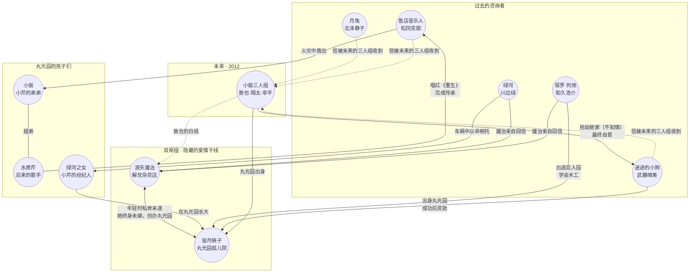

# 《解忧杂货店》人物关系图谱

## 制作方法

1. **找枢纽**：先找"所有人都要经过的节点"——本书是双枢纽结构（杂货店 × 丸光园）
2. **定粒度**：一人一圈，次要人物合并（三人组算一个点）
3. **边的语义**：每条箭头写动词（咨询 / 救助 / 出身 / 传承）
4. **线型编码时间**：实线 = 现实关系，虚线 = 跨时空信件

## 图谱（GitHub 可直接渲染）

## 读图要点

- **隐藏干线**：雄治与暁子的旧情是整张图的地基——杂货店和丸光园这两个"收留烦恼与孩子"的地方，本就是一对恋人的遗物
- **两个时代**：咨询者都在 1970–80 年代，回信的三人组在 2012 年，虚线全部跨越三十余年
- **闭环**：三人组抢劫的正是他们回信指导致富的晴美；敦也的白纸信被三十多年前的雄治亲自回复——图的最外圈在终点合拢
